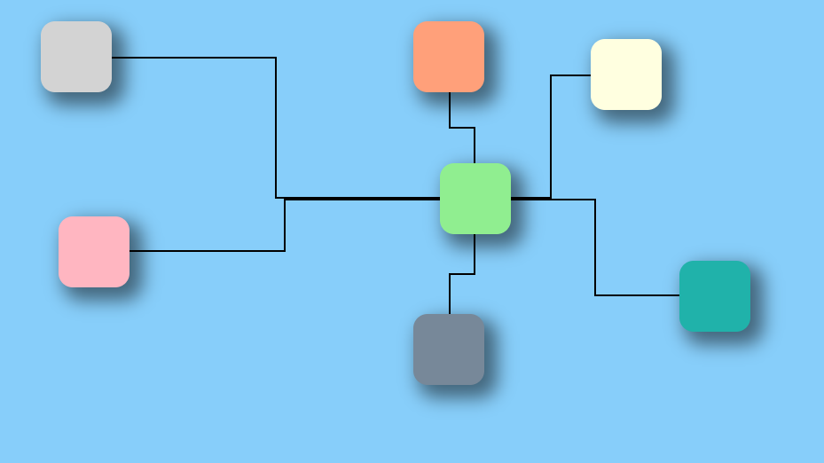

# Dashboard with CSS Anchor Positioning API

An experimental package demonstrating how to build dashboard node connections and relational diagrams using the modern **CSS Anchor Positioning API** combined with pure CSS gradient-based line drawing, minimizing the need for SVG or Canvas rendering.

---

## 📖 Overview & Motivation

Building node-based interfaces, workflow editors, or connected dashboard widgets traditionally requires SVG `<path>` elements or HTML5 `<canvas>` rendering loops. These approaches necessitate calculating absolute bounding boxes and coordinates via JavaScript on every frame or resize event.

This experiment explores a modern CSS-first alternative:

- **Declarative Tethering:** Elements are tethered to one another using native CSS Anchor Positioning (`anchor-name` and `anchor()`).
- **CSS-Powered Connectors:** Multi-segment orthogonal connection lines (wires) are rendered purely in CSS using layered `linear-gradient` backgrounds.
- **Minimal JavaScript:** JavaScript is only used for pointer interaction (dragging) and topological quadrant classification (e.g. determining if node A is above or below node B to apply appropriate gradient orientation classes).

---

## 🏗️ Architecture & Demonstrations

The package is split into a tabbed wrapper and two interactive demonstrations:

```text
packages/dashboard-css-anchoring/
├── index.html            # Main container using CSS Grid & Subgrid with <details> tabs
├── app/
│   ├── app.css           # Shell styling & subgrid tab system
│   ├── reset.css         # Baseline CSS resets
│   ├── static/           # Static connection topology demo
│   │   ├── index.html    # Static layout with 7 anchored boxes and connecting links
│   │   ├── app.css       # Anchor definitions and multi-directional gradient lines
│   │   └── app.js        # Minimal app bootstrapper
│   └── dynamic/          # Dynamic drag-and-drop demo
│       ├── index.html    # Interactive canvas with draggable Box 1 and target Box 2
│       ├── app.css       # Dynamic anchor links with directional modifier classes
│       └── app.js        # Pointer event handling & quadrant detection logic
```

### 1. Static Version (`app/static/`)

Showcases various orthogonal connection topologies between a central target box (`--box2`) and multiple source boxes placed around it (top-left, bottom-left, top-right, bottom-right, directly above, directly below).



### 2. Dynamic Version (`app/dynamic/`)

Allows moving Box 1 around Box 2 via pointer drag. As Box 1 moves:

1. CSS Anchor Positioning automatically recalculates and resizes the connection box in real-time.
2. A lightweight JavaScript helper detects the relative orientation (`above`, `below`, `left`, `top`) and switches CSS modifier classes to update the gradient wire direction.

<video controls height="600" width="800">
  <source src="./demo-dynamic.webm" type="video/webm">
  <source src="./demo-dynamic.mp4" type="video/mp4">
</video>

---

## ⚙️ Technical Approach

### 1. Declaring Anchors

Elements register themselves as named anchors using the `anchor-name` CSS property:

```css
.box.box--one {
  anchor-name: --box1;
  top: 25px;
  left: 55px;
}

.box.box--second {
  anchor-name: --box2;
  top: 185px;
  left: 505px;
}
```

> **Note on DOM Ordering:** Link elements must be declared **after** the boxes in the DOM tree so that the anchors are resolved properly during style and layout computation.

### 2. Sizing & Positioning the Link Element

The `.link` connector element spans between the source and destination anchors using logical inset properties and the `anchor()` function:

```css
.link--box1-to-box2 {
  /* Tether link boundaries to the centers/edges of box 1 and box 2 */
  inset-block-start: anchor(--box1 center);
  inset-inline-start: anchor(--box1 right);
  inset-inline-end: anchor(--box2 left);
  inset-block-end: anchor(--box2 center);
}
```

The browser engine automatically computes the dimensions and position of `.link` based on where `--box1` and `--box2` are positioned.

### 3. Rendering Connector Wires with CSS Gradients

Instead of injecting SVG paths, orthogonal connection lines are created with layered `linear-gradient` backgrounds:

```css
.link {
  position: absolute;
  min-block-size: 2px;
  background-image:
    linear-gradient(to bottom, black, black),
    linear-gradient(to right, black, black),
    linear-gradient(to bottom, black, black);
  background-size:
    2px,
    50% 2px,
    50% 2px;
  background-position:
    center,
    top left,
    bottom right;
  background-repeat: no-repeat;
}
```

Different modifier classes (e.g., `.link--on-left-bottom`, `.link--on-above`, `.link--on-below`) adjust the gradient positions and sizes to accommodate all spatial quadrants (e.g. zig-zag vs. straight vertical/horizontal segments).

### 4. Dynamic Interaction & Quadrant Detection

In the dynamic demo, dragging updates the source node's `left` and `top` inline styles. JavaScript determines the topological position of Box 1 relative to Box 2:

```javascript
function getBox1PositionToBox2(box1Element, box2Element) {
  const box1Position = getBoxPosition(box1Element);
  const box2Position = getBoxPosition(box2Element);

  const left =
    box1Element.clientWidth / 2 + box1Position.x <
    box2Position.x + box2Element.clientWidth / 2;
  const top =
    box1Element.clientHeight / 2 + box1Position.y <
    box2Position.y + box2Element.clientHeight / 2;
  const above = /* ... */;
  const below = /* ... */;

  return { left, top, above, below };
}
```

The corresponding CSS class (`link--left-top`, `link--on-above`, etc.) is applied to `.link`, allowing the CSS gradients and anchor insets to redraw the connector accurately without performing manual canvas/SVG line math.

---

## ⚖️ Pros and Considerations

| Advantages                                                                                                   | Considerations & Limitations                                                                                                          |
| :----------------------------------------------------------------------------------------------------------- | :------------------------------------------------------------------------------------------------------------------------------------ |
| **Zero SVG/Canvas Overhead:** Connectors are standard DOM elements sized and laid out by the browser engine. | **Browser Compatibility:** Relies on the CSS Anchor Positioning API (Chromium 125+).                                                  |
| **High Performance:** Smooth resizing and positioning handled directly during browser layout.                | **DOM Order Dependency:** Anchors must precede link elements in the DOM.                                                              |
| **Declarative Styling:** Colors, borders, hover states, and animations can be styled directly in CSS.        | **Complex Routing:** Advanced curved paths (e.g., Bézier curves) or complex obstacle avoidance still require SVG/Canvas or polyfills. |

---

## 🚀 Getting Started

### Run Local Development Server

Run the development server with HTTPS (using Parcel) on port 3555:

```bash
npm --workspace=packages/dashboard-css-anchoring start
# or from this directory:
npm start
```

Open your browser at `https://localhost:3555`.

---

## 📚 References & Resources

- [Drawing a Line to Connect Elements with CSS Anchor Positioning](https://master.dev/blog/drawing-a-line-to-connect-elements-with-css-anchor-positioning/)
- [Drawing Connections with CSS Anchor Positioning](https://rolandfranke.nl/frontend-stories/drawing-connections-with-css-anchor-positioning/)
- [JavaScript Get Mouse Coordinates](https://screencoordinates.com/javascript-get-mouse-coordinates/)
- [CSS Anchor Positioning Guide (CSS-Tricks)](https://css-tricks.com/css-anchor-positioning-guide/)
- [Tether elements to each other with CSS anchor positioning (Chrome for Developers)](https://developer.chrome.com/blog/tether-elements-to-each-other-with-css-anchor-positioning)

---

## 🤝 Contributing

- [Guidelines](../../docs/GUIDELINES.md)
- [Contributing](../../docs/CONTRIBUTING.md)
- [Code of Conduct](../../docs/CODE_OF_CONDUCT.md)
